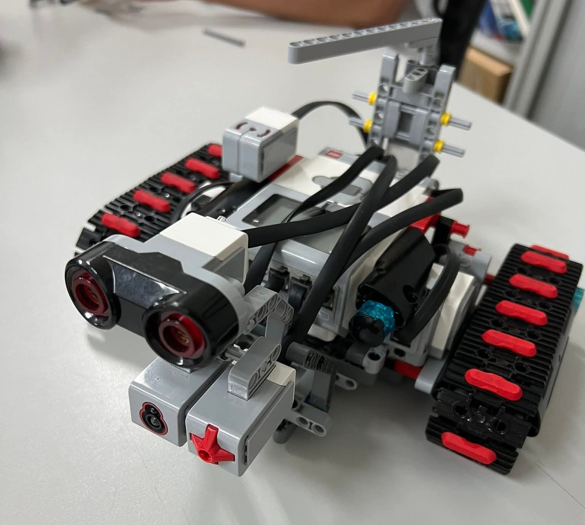
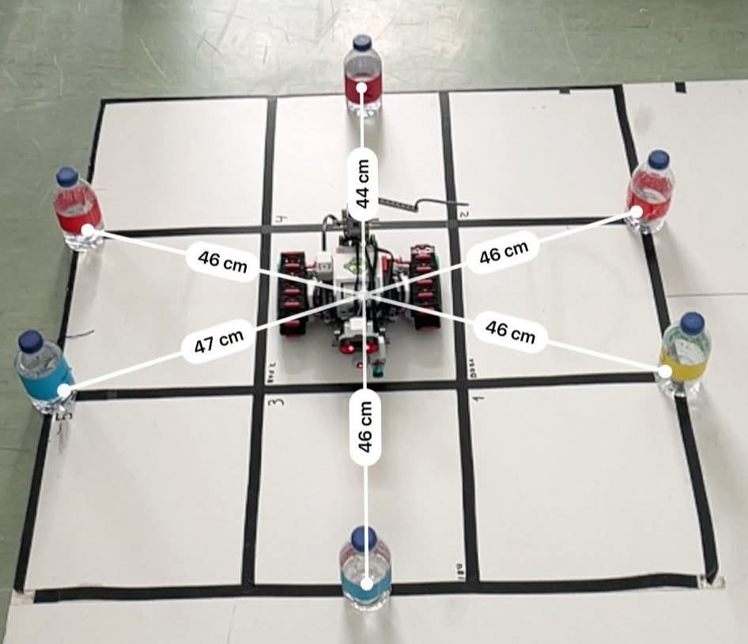
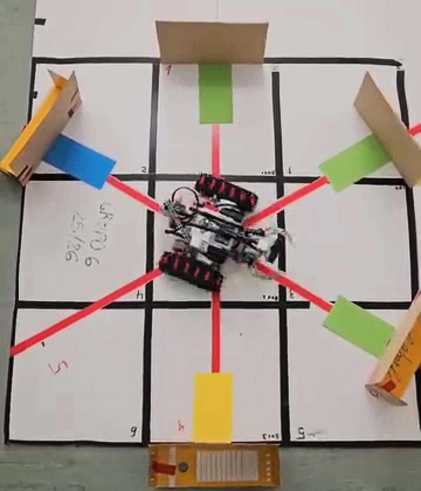

# Defender-Bot - Projeto de Inteligência Artificial

## Objetivo do Projeto

O **Defender-Bot** é um sistema de inteligência artificial desenvolvido para atuar como um robô de defesa em um cenário de combate simulado. O objetivo principal é programar um robô que, em um ambiente de 13 turnos, consiga reconhecer forças inimigas, planear ataques e curas estratégicas, e sobreviver ao ataque combinado de diferentes unidades inimigas (tanques, artilharia e infantaria). O projeto visa aplicar conceitos de heurísticas, tomada de decisão e controlo de ações em tempo real, usando técnicas de IA para otimizar a sobrevivência do robô.



## Conceitos Teóricos

Este projeto envolve várias áreas de inteligência artificial e programação, incluindo:

- **Reconhecimento de ambiente:** usando sensores para identificar inimigos e as suas posições.
- **Heurísticas de decisão:** implementação de estratégias para decidir quando atacar, curar ou reconhecer inimigos, visando maximizar a sobrevivência.
- **Controlo de ações:** gestão de ataques, curas e reconhecimento, respeitando restrições de energia e uma única ação por slot/turno.
- **Programação de robôs:** controlo do hardware do EV3, usando Python (ev3dev2) para movimentação, ataque e reconhecimento.

## Como Executar

O projeto foi desenvolvido em Python, utilizando a plataforma EV3 com o sistema ev3dev2. Para executar:

1. Certifique-se de que o hardware EV3 está configurado corretamente com o sistema ev3dev2.
2. Conecte os sensores e motores conforme necessário.
3. Transfira o código para o EV3.
4. Execute o arquivo `main.py` com Python 3 no EV3:
   
```bash
python3 main.py
```

O programa executa, turno a turno, um ciclo contínuo de reconhecimento, ataque, cura e tomada de decisão, mantendo-se ativo até ao final do jogo ou até ser interrompido manualmente.

O robô deve ser posicionado no centro de um ambiente semelhante ao ilustrado nas imagens. Esse ambiente deve incluir fitas de cor vermelha dispostas nas diagonais entre cada ponto de spawn de inimigos, para permitir ao robot orientar-se ao longo das suas ações.

Cada tipo de inimigo é identificado por uma cor específica, colocada junto ao respetivo objeto em cada ponto de spawn:
- Tanque: cor verde
- Artilharia: cor amarela
- Infantaria: cor azul





## Detalhes do Projeto

- **Reconhecimento:** o robô usa sensores de cor, ultrassônico e giroscópio para identificar inimigos e as suas posições.
- **Ataques:** três tipos de ataques com diferentes custos e impactos:
  - Grua (200 uv, custo 300 en)
  - Toque (100 uv, custo 150 en)
  - Som (50 uv, custo 50 en)
- **Curas:** três níveis de cura, com diferentes recuperações e custos:
  - Cura 1 (100 uv, 200 en)
  - Cura 2 (200 uv, 300 en)
  - Cura 3 (400 uv, 400 en)
- **Heurística:**
A heurística foi desenvolvida para permitir ao robô avaliar de forma inteligente o potencial de dano de cada inimigo, considerando a sua força, tipo e vida atual. A ameaça de cada inimigo é calculada com base no dano que pode infligir, tendo em conta a sua força e a percentagem de vida restante. Com isso, o robô consegue priorizar os adversários mais perigosos.

No momento de ataque, a heurística realiza as seguintes avaliações:

1. **Estimativa de dano:** calcula o dano que seria causado ao inimigo e compara-o com a sua ameaça atual.
2. **Eficiência do ataque:** avalia o dano evitado em relação ao custo energético necessário para executar o ataque.
3. **Bónus e penalizações:** atribui bónus a ataques dirigidos a inimigos de maior risco, como artilharia e tanques, e à eliminação de inimigos. Penaliza ataques que resultem em dano excessivo (overkill), evitando desperdício de energia.

O objetivo é garantir que o robô atue de forma eficiente, atacando as maiores ameaças com o menor custo possível, preservando energia e maximizando a sua sobrevivência. Assim, a prioridade de ataque é ajustada dinamicamente, dependendo da ameaça real de cada inimigo.

## Avaliação

Este projeto recebeu uma nota final de **17,5 valores** na disciplina de Inteligência Artificial, na Universidade da Madeira, sob orientação do professor Eduardo Fermé.

## Considerações Finais

Este trabalho integra sensores, controlo de hardware, heurísticas e estratégias de IA num cenário de combate simulado. O robô detecta inimigos com sensores ultrassónicos e de cor, prioriza ameaças e decide ataques de forma eficiente. O código modular permite fácil manutenção e expansão, combinando navegação, reconhecimento e tomada de decisão autónoma, demonstrando aplicação prática de robótica inteligente e otimização de recursos.
